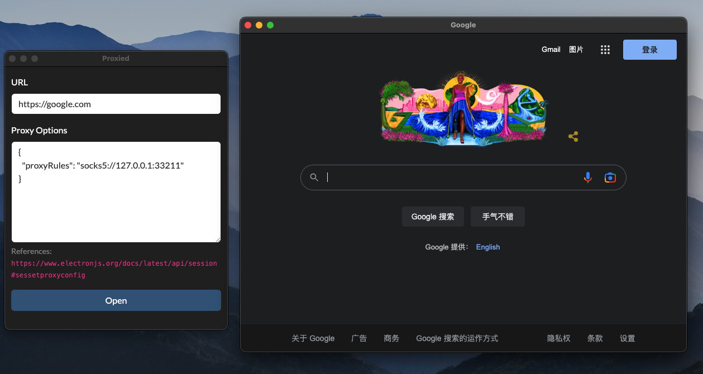

# Proxied

a simple Electron app for opening a website with a speicifed proxy

## UI



## FAQ

**Can I use PAC config ?**

yes, you can check ElectronJS documentation for details

https://www.electronjs.org/docs/latest/api/session#sessetproxyconfig

**How to open an unsigned macOS application ?**

1. Remove `com.apple.quarantine` attribute

    ```shell
    sudo xattr -d com.apple.quarantine /Applications/Proxied.app
    ```

2. Open with signature validation bypassed

   1. Right click `Proxied.app`
   2. Hold `Option` key and click `Open`
   3. Try again until dialog with `Open` button shows

## Release Note

* v1.0.1
  * Add `Command+N` shortcut to open a another welcome dialog

* v1.0.0
  * First usable release

## Donation

See https://guoyk.xyz/donation

## Credits

Guo Y.K., MIT License